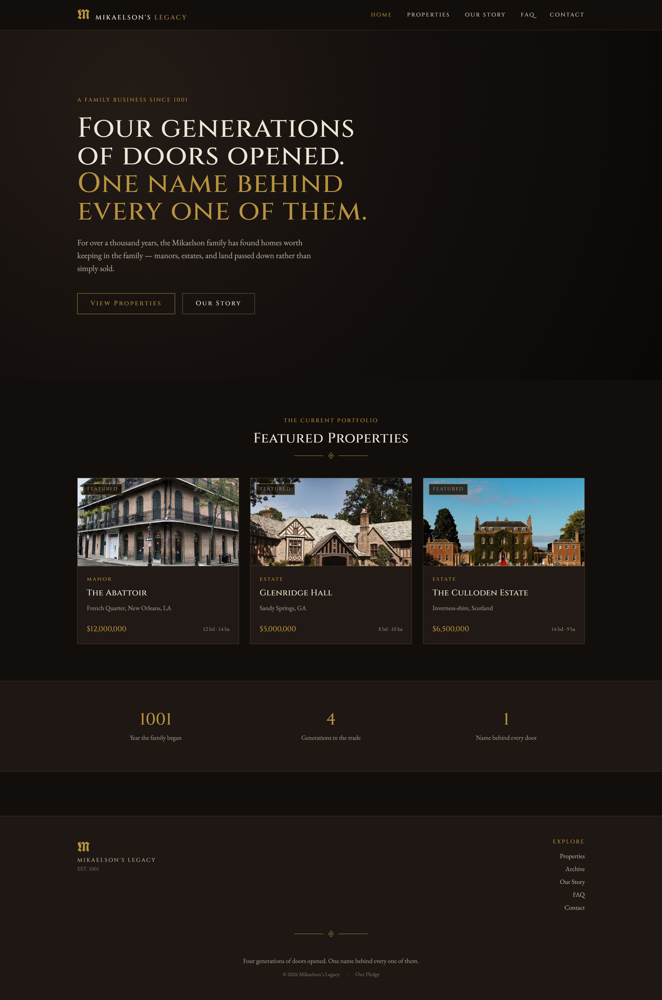
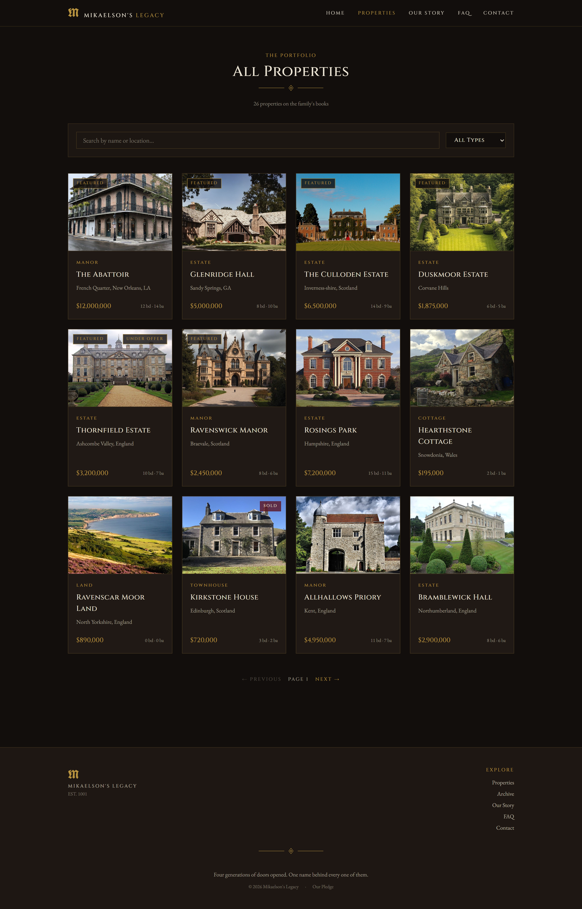
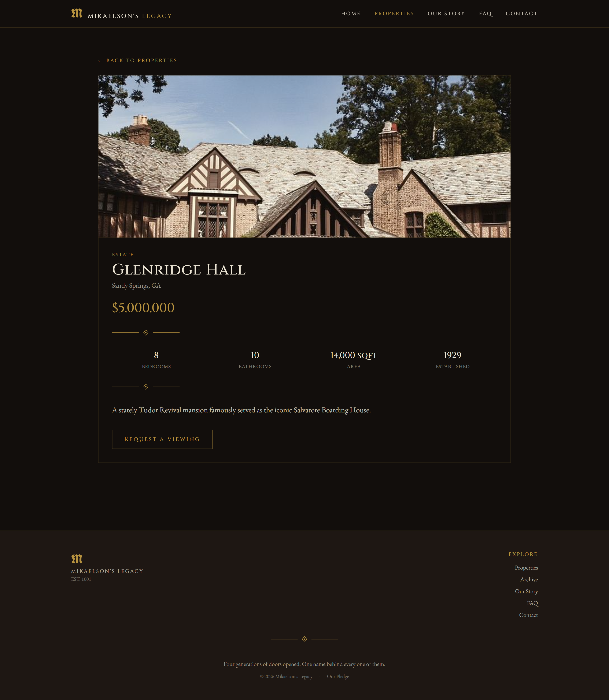
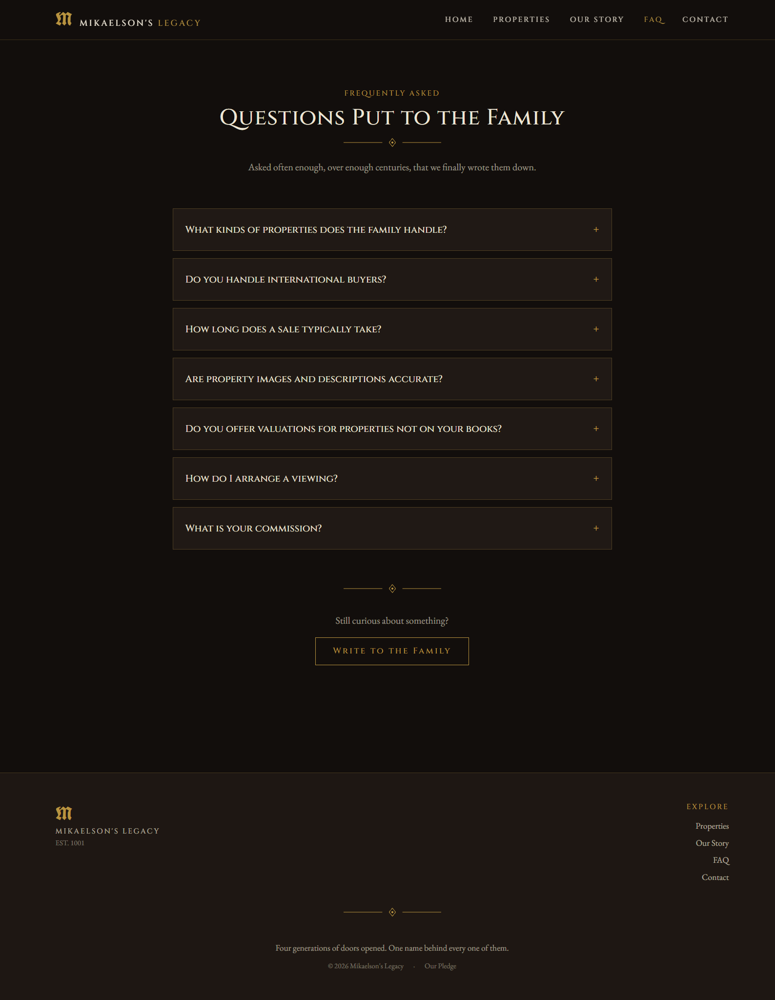
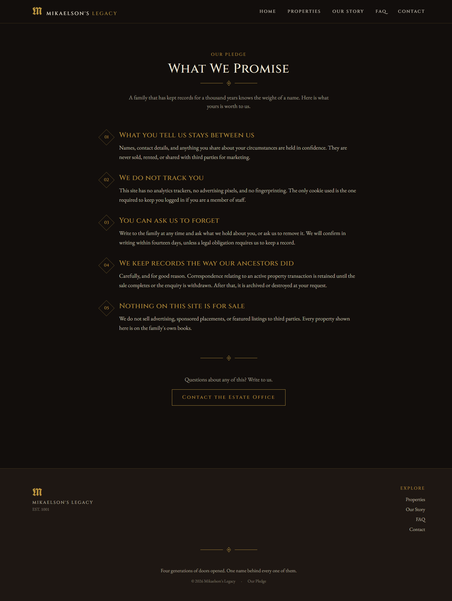
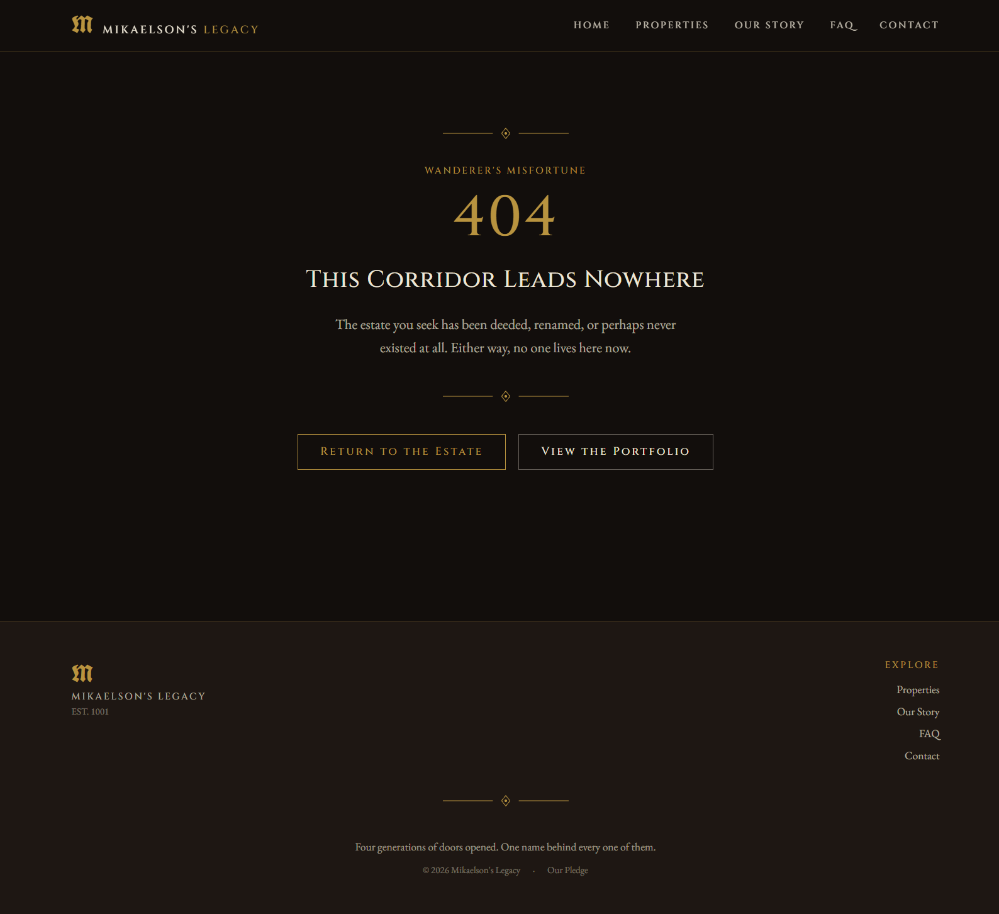
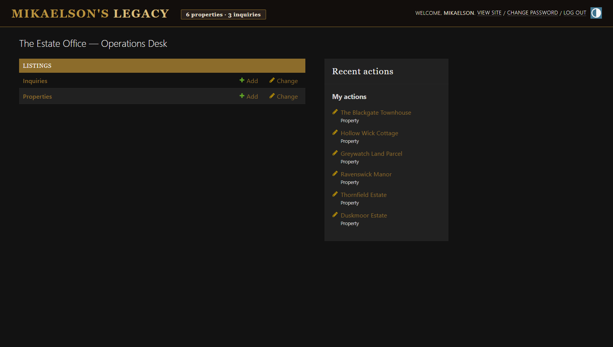

# Mikaelson's Legacy — Simple Edition

A simplified, beginner-friendly rebuild of your project. Same idea (a real
estate site for the Mikaelson family business, est. 1001 AD, gothic look),
but stripped down to what a fresher can actually read top to bottom:



| | Original | This version |
|---|---|---|
| Backend apps | 8 apps (users, agents, leads, properties, favorites, core, insights, tours) | **1 app** (`listings`) |
| Auth | Custom user model + JWT | **None** — public site only |
| Frontend | Next.js 14, TypeScript, 4 separate interfaces (public/dashboard/agent/admin) | **Vite + plain React (JS)**, one public site |
| Admin panel | Custom-built React admin | **Django's built-in `/admin/`** (free, no code needed) |
| Pages | ~20 routes | 5 routes: Home, Properties, Property Detail, About, Contact |

Same stack you asked for: **Django 5 + DRF + React (Vite) + Tailwind CSS +
PostgreSQL.**

---

## 1. What you need installed first

- **Python 3.11+** — check with `python3 --version`
- **Node.js 18+** — check with `node --version`
- **PostgreSQL** running locally — check with `psql --version`

If any of those are missing, install them before continuing.

---

## 2. Backend setup (Django + DRF)

```bash
cd backend

# 1. Create and activate a virtual environment
python3 -m venv venv
source venv/bin/activate        # Windows: venv\Scripts\activate

# 2. Install dependencies
pip install -r requirements.txt

# 3. Create your local settings file
cp .env.example .env
# open .env and set your real PostgreSQL username/password

# 4. Create the database (one-time, in psql or a GUI like pgAdmin)
#    CREATE DATABASE mikaelsons_legacy;

# 5. Create the tables
python manage.py migrate

# 6. Create yourself an admin login
python manage.py createsuperuser

# 7. Add sample properties so the site isn't empty
python manage.py seed_properties

# 8. Run the server
python manage.py runserver
```

Your API is now live at **http://localhost:8000/api/**. Try:
- http://localhost:8000/api/properties/
- http://localhost:8000/admin/ (log in with the superuser you made — this
  is where you add/edit properties and see contact form messages, no
  extra code required)

---

## 3. Frontend setup (React + Vite + Tailwind)

Open a **second terminal** (leave the Django server running in the first):

```bash
cd frontend

# 1. Install dependencies
npm install

# 2. Create your local env file
cp .env.example .env
# the default (http://localhost:8000/api) is already correct if you
# didn't change the backend port

# 3. Run the dev server
npm run dev
```

Open **http://localhost:5173** in your browser. You should see the site.

---

## 4. How the two halves talk to each other

```
React (localhost:5173)  --fetch-->  Django REST API (localhost:8000/api)
```

`django-cors-headers` is already configured in `backend/config/settings.py`
to allow requests from `localhost:5173`. If you ever change the frontend
port, update `CORS_ALLOWED_ORIGINS` in that file too.

---

## 5. Project structure

```
mikaelsons-legacy/
├── backend/
│   ├── manage.py
│   ├── requirements.txt
│   ├── config/            # Django project settings & URLs
│   └── listings/          # the ONE app: models, serializers, views, admin
│       ├── models.py      # Property, Inquiry
│       ├── serializers.py
│       ├── views.py       # PropertyViewSet, InquiryCreateView
│       ├── urls.py
│       ├── admin.py       # this is your admin panel, no code needed
│       └── management/commands/seed_properties.py
│
└── frontend/
    └── src/
        ├── api/client.js       # all API calls live here
        ├── components/         # Navbar, Footer, PropertyCard, OrnamentDivider
        └── pages/               # Home, Properties, PropertyDetail, About, Contact
```

**Reading order if you're new to this:** `models.py` → `serializers.py` →
`views.py` → `urls.py` on the backend, then `api/client.js` → `pages/Home.jsx`
on the frontend. That's the whole request/response loop in 5 files.

---

## 6. Adding real property photos

Go to **http://localhost:8000/admin/**, click into "Properties," and upload
an image on any property — Django handles the storage automatically. The
frontend shows a placeholder crest for any property with no image, so
nothing breaks in the meantime.

---

## 7. Where to go from here (once this makes sense)

Once you're comfortable with this version, you already have a natural path
back toward your original, more advanced project — add features one at a
time instead of all at once:

1. User accounts (Django's built-in `User` model + `djangorestframework-simplejwt`)
2. A "saved properties" favorites list (one small model + one small app)
3. An agent/staff role (a `role` field on the user, or Django's `is_staff`)
4. A blog/insights section (one more small app, same pattern as `listings`)

Each of those is basically "copy the `listings` app pattern for a new model."

---

## Screenshots

### Public Site

| Home | Properties | Property Detail |
|---|---|---|
|  |  |  |

| FAQ | Our Pledge | 404 |
|---|---|---|
|  |  |  |

### Estate Operations (Django Admin)

The `/admin/` panel is used by the family to manage properties and read customer inquiries. It has been themed to match the public site - no custom dashboard code needed.



---